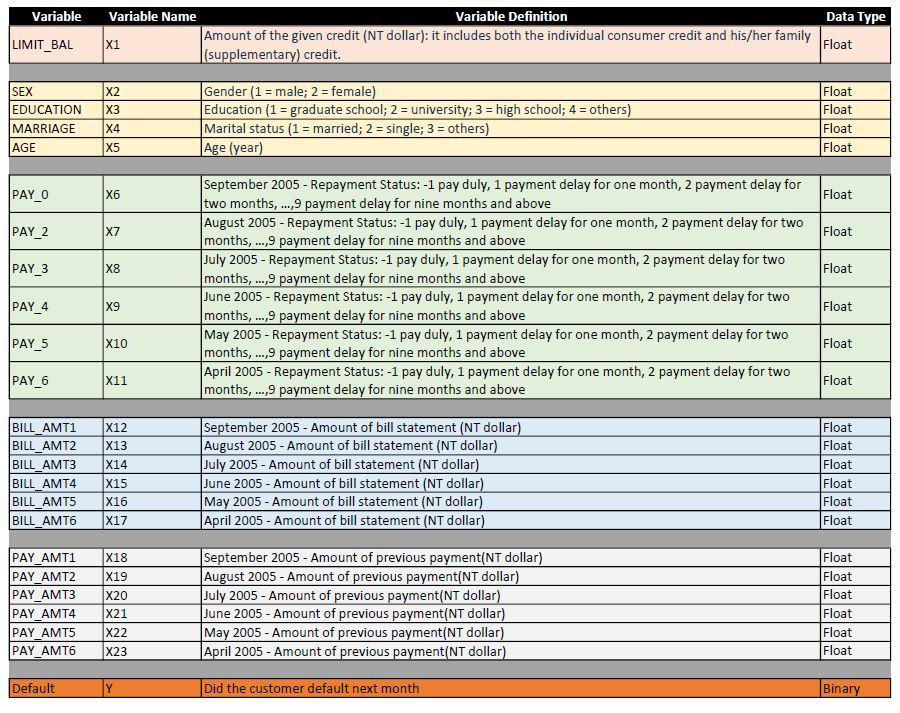

# Competition 2 | 3 Musketeers
#### BA545 | Spring 2019 
#### Kevin Hickey | Martin Browne | Stuart Weinstein

**Analytical Question & Goal:**

What is the likelihood that a credit card client will default and ultimately force the closure of their account?  We were tasked with predictiing the likelihood of this worst case outcome for each ID in the test set.  To do this we must predict the binary value of the default variable.

**Files in the repository:**

- The Final Project notebook explains our work process and understanding: [Final_project](Final_project.ipynb)

- The Data Dictionary: ****
*Which we updated after creating our engineered features link to complete data dictionary*:  **[Data Dictionary](complete_data_dic.xlsx)** 

 - The Modules PY file : We created custom definitions to read the data file, rename the columns, generate some charts, evaluate a baseline model, and a XGBoost evaluate: These modules  mean the code is reproduceable for each model or pipeline we attempt.  **[Modules](Modules.py)** 
 
 - Intial Model report submission **[Initial_models](Initial_models.ipynb)** 
 - Data Audit report submission **[data_audit_report](data_audit_report.ipynb)**
 
 